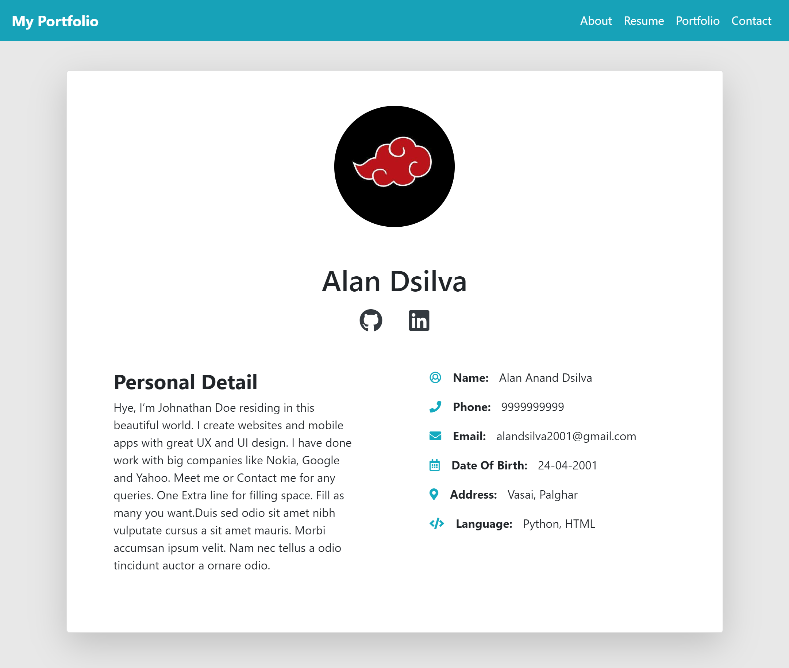

# Installation instructions
* Open terminal(powershell, cmd for windows or bash shell for linux) in project folder `Assignment-4` after cloning repository
* Enter command `python manage.py runserver` for windows or `py manage.py runserver` for linux in your terminal.
* Enter localhost:8000 in your browser

# Preview

## Dependencies
* Python
* Django
* import_export (use pip or easy_install)